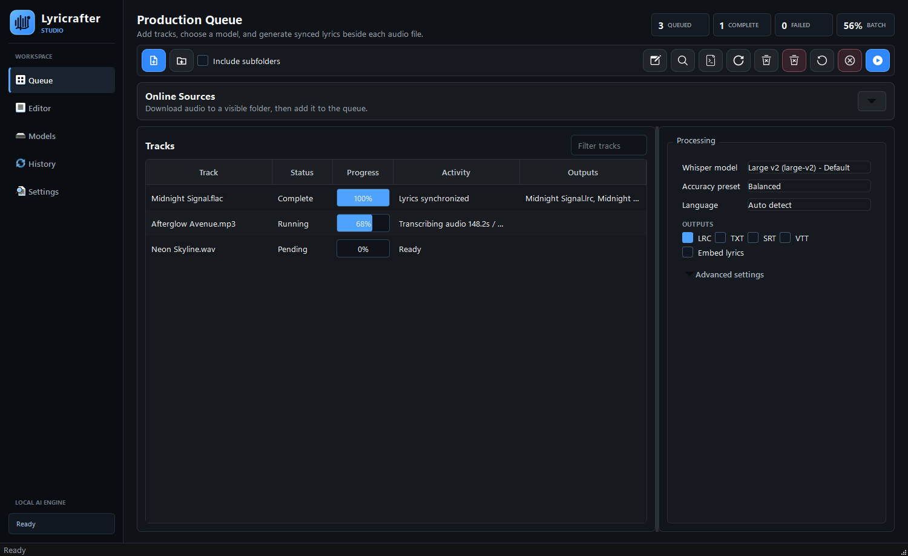
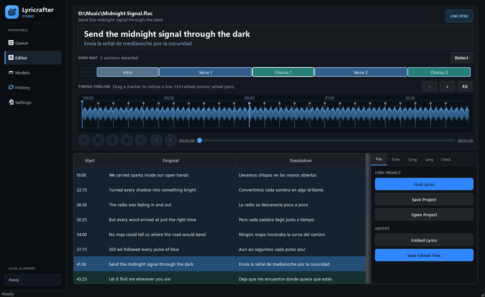
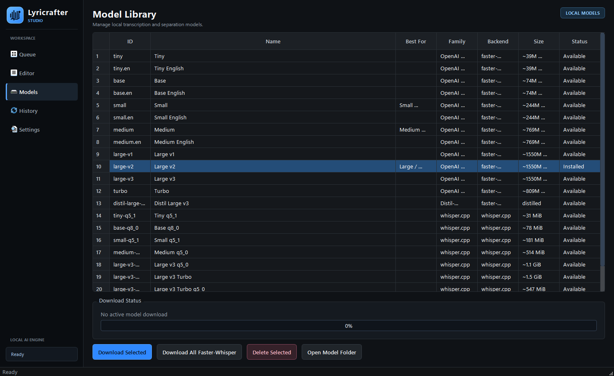

# Lyricrafter Studio

[](https://github.com/jaylex32/Lyricrafter/actions/workflows/build-desktop.yml)
[](https://github.com/jaylex32/Lyricrafter/releases/latest)

Local AI lyric transcription, synchronization, translation, editing, and embedding for Windows, macOS, and Linux.

Lyricrafter turns audio into synchronized `.lrc` lyrics and clean text files while keeping processing local. It supports individual tracks and batches, preserves the source filename, saves beside the audio, and provides a timing-focused editor for correcting the result.



## Highlights

- Local `faster-whisper` transcription with word timestamps and CPU/CUDA selection.
- Batch queue with per-track and overall progress, retry, regeneration, and cancellation.
- `.lrc`, `.txt`, `.srt`, and `.vtt` output with version-safe filenames.
- Waveform timing editor with synchronized playback, draggable markers, and line-level editing.
- Song Map detection for verses, choruses, bridges, intros, and repeated-section repair.
- Optional local NLLB translation with bilingual lyric preview and export.
- LRCLIB, local files, captions, Genius-compatible plain text, and synced lyric source workflows.
- Optional Demucs vocal isolation for difficult mixes.
- Lyrics embedding for supported audio containers.
- URL audio acquisition through yt-dlp with track metadata and cover handling.
- MusicBrainz metadata enrichment and Cover Art Archive artwork.
- Downloadable model library; model weights are never bundled into the application package.

## Lyric Editor



The editor keeps playback, timing, lyrics, translation, and song structure in one workspace. Repeated sections can use a selected master while preserving the target section's timing.

## Model Library



Recommended starting points:

| System | Model | Use case |
| --- | --- | --- |
| Small | `small` | Lower memory use and faster CPU processing |
| Medium | `medium` | Balanced accuracy and resource use |
| Large / Default | `large-v2` | Current Lyricrafter quality baseline |

Models download into writable user storage and can be removed from the Model Library. Existing Hugging Face caches are detected and reused when compatible.

## Windows Installation

The Windows package is a single CPU-ready installer. CUDA libraries and AI model weights are not bundled.

1. Download and run `Lyricrafter-Windows-x64-Setup.exe`.
2. Open Models and download a recommended Whisper model.
3. On a compatible NVIDIA system, choose `Install NVIDIA Support` in Models to download optional Whisper acceleration.

Use `SHA256SUMS.txt` from the release to verify the downloaded parts. The package is unsigned, so Windows SmartScreen may display a warning. Models require additional disk space; `large-v2` uses several gigabytes.

## Source Setup

Python 3.10 or newer is required. Python 3.12 is used by release automation.

```powershell
.\scripts\setup.ps1 -WithSeparation
.\scripts\run.ps1
```

For NVIDIA acceleration when running from source:

```powershell
.\scripts\enable_cuda.ps1
```

Then set Device to `cuda` and Compute to `auto` or `float16`. CPU `int8` remains available as a fallback.

## Tests And Packages

```powershell
.\.venv\Scripts\python.exe -m pytest
.\.venv\Scripts\python.exe scripts\build_release.py
.\.venv\Scripts\python.exe scripts\test_packaged_app.py --model-download
```

The frozen-package test verifies application resources, FFmpeg, AI/native imports, SQLite, writable model storage, real model download, CPU inference, model deletion, and GUI startup.

GitHub Actions builds native packages for Windows x64, Linux x64, macOS Apple Silicon, and macOS Intel. macOS packages are not notarized yet.

## Privacy

Audio transcription, synchronization, translation, and editing run locally. Network access is used only for features that inherently require it, including model downloads, online lyric sources, URL media downloads, and metadata enrichment.
